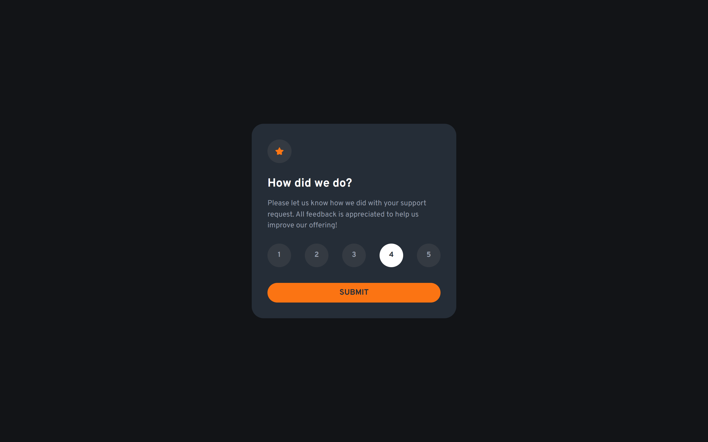
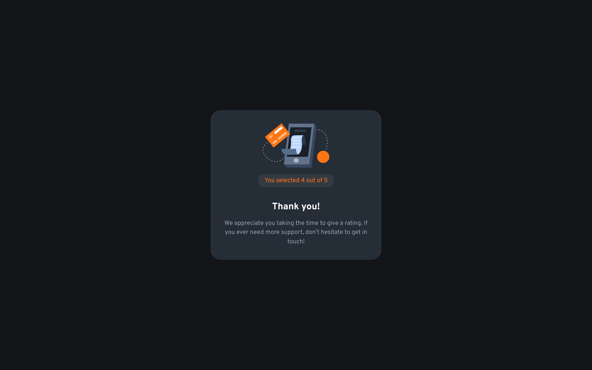

# Frontend Mentor - Interactive rating component solution

This is a solution to the [Interactive rating component challenge on Frontend Mentor](https://www.frontendmentor.io/challenges/interactive-rating-component-koxpeBUmI).

This challenge allows users to rate a product by selecting a number of stars. The user can also submit their rating by clicking a button.

## Overview

### Screenshot

- Rating state
  

- Thank you state
  

### User Stories

- User can rate a product by selecting a number of stars
- User can submit their rating by clicking a button

### Links

- [Live Site](https://erik5ca.github.io/interactive-rating-component/)

## My process

I started by creating the HTML structure of the component. I then added the CSS styles to make it look like the design. I added the JavaScript code to handle the user interactions and display the rating state.

Finally, I added the logic to show the thank you message when the user submits their rating.

I aplied accessibility best practices to make the component accessible to all users.

### Built with

- Semantic HTML5 markup
- CSS custom properties
- Flexbox
- Mobile-first workflow
- Accessibility best practices

## Author

- [Likedin](https://www.linkedin.com/in/erik-castillo-b48b12239)
